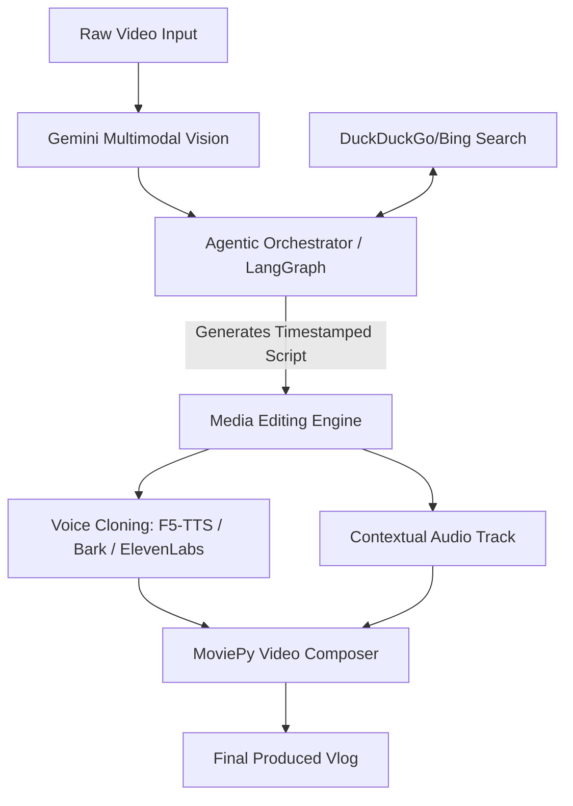

# GenAI Travel Vlog Director 🎬✈️

An automated, agentic pipeline that transforms raw travel footage (e.g., bike rides, road trips, walking tours) into a produced travel vlog complete with context-aware voiceovers, local historical facts, audio ducking, and reference voice cloning.

---

## 📖 Table of Contents
1. [Key Features](#-key-features)
2. [Architecture Overview](#-architecture-overview)
3. [Project Directory Structure](#-project-directory-structure)
4. [Prerequisites & Installation](#-prerequisites--installation)
5. [Starting the Services](#-starting-the-services)
   - [Local F5-TTS Voice Server](#1-local-f5-tts-voice-cloning-server-optional)
   - [Backend FastAPI Server](#2-fastapi-backend)
   - [Frontend React UI](#3-frontend-react-ui)
6. [API Endpoints Reference](#-api-endpoints-reference)
7. [Running Tests](#-running-tests)
8. [License](#-license)

---

## ✨ Key Features
* **Multimodal Frame Analysis**: Leverages Google Gemini 1.5 Pro to ingest raw footage, identify geographic regions, scenes, and visual milestones, and establish timestamps.
* **Agentic Web Enrichment**: Built on an agentic state flow that conducts Google/Bing search queries on detected landmarks to fetch rich historical, cultural, and travel facts.
* **Voice Cloning & Synthesis**: 
  * Clones the travel host's voice using a short reference audio file.
  * Supports cloud-based **ElevenLabs**, local **Bark (transformers)**, or local **F5-TTS** (self-hosted).
* **Smart Audio Ducking**: Blends background music dynamically, ducking music volume by 65-70% when speech overlays are playing and restoring it during visual-only scenes.
* **Responsive Control Center**: Beautiful React/Vite-based workspace to monitor jobs, upload clips, select voice clones, track rendering, and preview final vlogs.

---

## 📐 Architecture Overview

The system decouples **video comprehension** (Vision model) from **media generation** (TTS + editing backend), utilizing an agent orchestrator to construct search queries, structure script pacing, and compile the final audio-video layers.



---

## 📁 Project Directory Structure
```
ai-vlog-director/
├── main.py                     # Entry point for the FastAPI backend application
├── config.py                   # Configuration management & environment setup
├── requirements.txt            # Python dependencies
├── database/                   # SQLite job storage management
│   ├── db.py                   # Session/engine setup
│   └── models.py               # SQLModel schemas for Vlog Jobs
├── api/                        # HTTP routes and validation
│   ├── routes.py               # Vlog pipeline processing logic
│   └── schemas.py              # Pydantic payloads
├── services/                   # Core business logic services
│   ├── agent.py                # LangGraph controller for search, scripts, & assembly
│   ├── search.py               # Search engine integrations (Bing, DuckDuckGo)
│   ├── tts.py                  # TTS Adapters (Mock, Edge-TTS, ElevenLabs, Bark, F5-TTS)
│   ├── video.py                # Media timeline stitching & audio ducking via MoviePy
│   └── video_description.py    # Video captioning and visual query generation
├── storage/                    # Temporary and raw video file storage
└── tests/                      # Pytest test suite
```

---

## 🛠️ Prerequisites & Installation

### 1. Requirements
* **Python**: `3.10` to `3.12` (recommended)
* **FFmpeg**: Required for MoviePy video processing and audio slicing.
  * *Mac*: `brew install ffmpeg`
  * *Linux*: `sudo apt-get install ffmpeg`

### 2. Clone and Setup Environment
Navigate to your workspaces and clone/configure the project:
```bash
git clone https://github.com/your-username/ai-vlog-director.git
cd ai-vlog-director

# Create virtual environment
python3 -m venv venv
source venv/bin/activate

# Install dependencies
pip install -r requirements.txt
```

### 3. Environment Variables
Create a `.env` file in the root of the repository matching the template:
```env
# Google Gemini API key (for video intelligence and script synthesis)
GEMINI_API_KEY=YOUR_GEMINI_API_KEY

# ElevenLabs API key (optional, for premium cloned digital twin voiceovers)
ELEVENLABS_API_KEY=

# Local F5-TTS server endpoint configuration (optional, for free voice cloning)
F5_TTS_HOST=http://localhost:9000

# Langfuse Tracing Configuration (optional, to monitor agent runs)
LANGFUSE_PUBLIC_KEY=
LANGFUSE_SECRET_KEY=
LANGFUSE_HOST=https://cloud.langfuse.com
```

---

## 🚀 Starting the Services

### 1. Local F5-TTS Voice Cloning Server (Optional)
If using local voice cloning, navigate to the `F5-TTS-Server` workspace directory and run:
```bash
# Activate your local python env (requires torch, torchaudio, and torchcodec)
source path/to/venv/bin/activate

# Run F5-TTS API Server on port 9000
HF_TOKEN="" uvicorn api.main:app --host 127.0.0.1 --port 9000
```

### 2. FastAPI Backend
Activate the virtual environment in `ai-vlog-director` and boot the backend server:
```bash
source venv/bin/activate
python main.py
```
The backend server runs at `http://localhost:8000`. Swagger API documentation is available at `http://localhost:8000/docs`.

### 3. Frontend React UI
Navigate to the `vlog-director-ui` workspace folder and run the development server:
```bash
npm install
npm run dev
```
Open `http://localhost:5173` to access the Control Center.

---

## 🔌 API Endpoints Reference

| Method | Endpoint | Description |
| :--- | :--- | :--- |
| **GET** | `/` | Health and status check |
| **POST** | `/api/vlog/upload` | Upload a raw video file to server storage |
| **POST** | `/api/vlog/process` | Trigger vlog agentic workflow for a job ID |
| **GET** | `/api/vlog/jobs` | Retrieve all current vlog job statuses |
| **GET** | `/api/vlog/status/{job_id}`| Get granular processing progress for a specific job |
| **GET** | `/api/vlog/models` | Get a list of supported voice models |
| **DELETE** | `/api/vlog/jobs/{job_id}`| Remove and clean up files from a vlog job |

---

## 🧪 Running Tests
The project features a full test suite checking agent routing, video frame parsing, database initialization, and TTS adapters.
```bash
# Run tests using pytest
pytest
```

---

## 📄 License
This project is licensed under the MIT License. See the LICENSE file for details.
