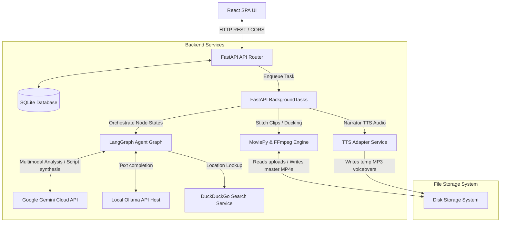
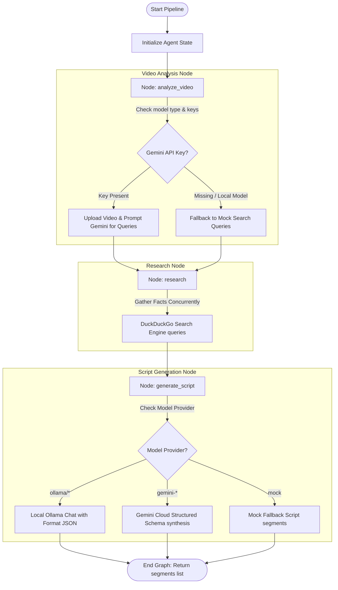
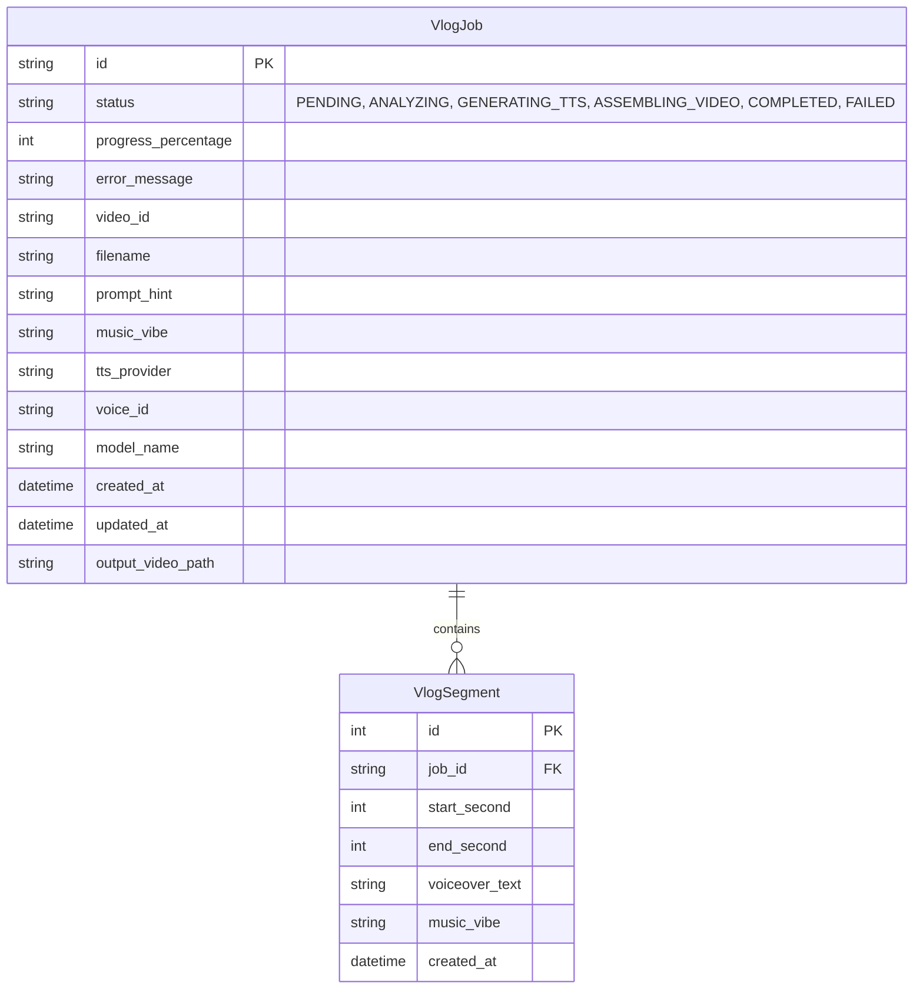

# System Architecture - AI Vlog Director

This document describes the high-level architecture and processing pipelines for the **AI Travel Vlog Director** application, combining a FastAPI backend, a React/TypeScript SPA frontend, and a LangGraph agentic pipeline.

---

## 1. System Overview

The application is structured into two main components:
1. **Frontend (`vlog-director-ui`)**: A React Single Page Application (SPA) styled with vanilla CSS, communicating asynchronously with the backend API.
2. **Backend (`ai-vlog-director`)**: A FastAPI Python application orchestrating SQLite database records, background task loops, AI models, and ffmpeg/moviepy media composition.



---

## 2. LangGraph Agent Graph Flow

The core intelligence is driven by a **LangGraph StateGraph** which coordinates visual analysis, web facts gathering, and script generation.



### Agent State Schema
The graph transitions using a thread-safe `AgentState` schema:
```python
class AgentState(TypedDict):
    video_path: str               # File path of source video on disk
    prompt_hint: Optional[str]    # User's narrative directions / hints
    music_vibe: str               # Chosen audio theme style
    model_name: str               # Chosen generative model ID
    search_queries: List[str]     # Target search terms compiled by Node 1
    search_results: Dict[str, str]# Raw text facts returned by Node 2
    script_segments: List[dict]   # List of narration segment timelines compiled by Node 3
    error: Optional[str]          # Optional error traceback details
```

---

## 3. End-to-End Processing Sequence (E2E Flow)

The following diagram tracks the E2E lifecycle of a vlog generation request, from the user's upload to background job polling, AI agent graph execution, voiceover synthesis, MoviePy sidechain audio ducking composition, and the final Master MP4 download:

```mermaid
sequenceDiagram
    autonumber
    actor User as Content Creator
    participant UI as React SPA
    participant Route as FastAPI API Endpoint
    participant DB as SQLite DB
    participant Graph as LangGraph Orchestrator
    participant LLM as AI Models (Gemini/Ollama)
    participant Web as DDG Search Engine
    participant TTS as TTS Service (EdgeTTS)
    participant Video as MoviePy / FFmpeg Engine

    User->>UI: Selects & Uploads Video file (up to 100MB)
    UI->>Route: POST /api/vlog/upload (Multipart file)
    Route->>Disk: Saves raw file under storage/uploads/v_id.mp4
    Route-->>UI: Returns video_id

    User->>UI: Chooses model, music vibe, voice, prompt & clicks "Start Director"
    UI->>Route: POST /api/vlog/process (options payload)
    Route->>DB: Inserts VlogJob (status="PENDING", progress=0)
    Route->>Route: Enqueues process_vlog_pipeline as BackgroundTask
    Route-->>UI: Returns job_id (202 Accepted)
    
    Note over UI, Route: UI starts polling /api/vlog/status/{job_id} every 2.5s
    
    rect rgb(20, 20, 30)
        Note right of Route: Background Task execution begins
        Route->>DB: Updates VlogJob (status="ANALYZING", progress=15)
        Route->>Graph: Invokes run_vlog_agent()
        
        Graph->>LLM: Node analyze_video: upload file & prompt visual analysis
        LLM-->>Graph: Returns visual summary & search queries (LandmarkSearch schema)
        
        Route->>DB: Updates VlogJob (status="ANALYZING", progress=35)
        
        Graph->>Web: Node research: query DDG concurrently
        Web-->>Graph: Returns search results context
        
        Route->>DB: Updates VlogJob (status="ANALYZING", progress=50)
        
        Graph->>LLM: Node generate_script: prompt narration timelines
        LLM-->>Graph: Returns CompleteScriptSchema (narration text segments)
        Graph-->>Route: Returns finished state variables (script_segments)
    end
    
    rect rgb(30, 20, 20)
        Note right of Route: Narrator and Video render begins
        Route->>DB: Updates VlogJob (status="GENERATING_TTS", progress=70)
        Route->>DB: Saves generated script segments to vlogsegment table
        
        loop For each script segment
            Route->>TTS: Request narration MP3 stream (Edge-TTS)
            TTS-->>Route: Writes voice_job_id_idx.mp3 to storage/temp/
        end
        
        Route->>DB: Updates VlogJob (status="ASSEMBLING_VIDEO", progress=85)
        
        Route->>Video: Call assemble_final_video()
        Video->>Video: Resolves music loop (checks storage/music/ or compiles dynamic synth WAV fallback)
        Video->>Video: Layers original audio (15% vol) + voice segments + bg music with ducking (to 3% vol)
        Video->>Video: Renders video via FFmpeg (libx264, aac codecs)
        Video-->>Route: Writes master_job_id.mp4 to storage/outputs/
    end

    Route->>DB: Updates VlogJob (status="COMPLETED", progress=100)
    
    UI->>Route: GET /api/vlog/status/{job_id} (Polled check)
    Route->>DB: Queries VlogJob details
    DB-->>Route: Returns Job record (status="COMPLETED")
    Route-->>UI: Returns job details & script segments timeline
    
    UI->>UI: Displays visual script timeline & enables download
    UI->>Route: GET /api/vlog/download/{job_id}
    Route-->>UI: Streams output master vlog MP4 for playback and download
```



---

## 4. Database Schema

The database relies on **SQLModel** (built on top of SQLAlchemy and Pydantic) to map tables dynamically.



---

## 5. API Endpoints

The FastAPI endpoints expose the full capability to client callers:

| Endpoint | Method | Description |
| :--- | :--- | :--- |
| `/api/vlog/upload` | `POST` | Ingests a raw MP4 video (up to 100MB) and returns a unique `video_id`. |
| `/api/vlog/process` | `POST` | Initiates the processing pipeline (creates a pending `job_id` and enqueues background processing). |
| `/api/vlog/process/{job_id}` | `POST` | Re-runs an existing pending or failed job in the background. |
| `/api/vlog/status/{job_id}` | `GET` | Returns job status, progress percentage, segments timeline, and errors. |
| `/api/vlog/jobs` | `GET` | Lists all past and active jobs in descending chronological order. |
| `/api/vlog/jobs/{job_id}` | `DELETE` | Removes a job record from the database and deletes associated video/audio files from disk. |
| `/api/vlog/models` | `GET` | Checks the local Ollama host dynamically and returns all available cloud Gemini and local models. |
| `/api/vlog/raw/{video_id}` | `GET` | Streams the uploaded raw source video. |
| `/api/vlog/download/{job_id}` | `GET` | Streams the compiled output video with narrated voiceovers and sidechain ducked background music. |
